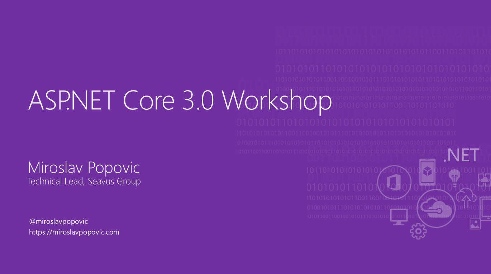

# ASP.NET Core 3.0 Workshop

Documentation and samples for ASP.NET Core 3.0 workshop.

**NOTE: This is a work in progress, using a preview version of .NET Core 3.0! Some planned features are not implemented because of bugs in EF Core 3.0 Preview and missing third-party library support for .NET Core 3.0**

This workshop is intended as a walk-through into .NET Core and ASP.NET Core 3.0 features, creating a new Web API, preparing it for production use and consuming it from client-side Blazor client.

The workshop is partially based on my talk [Building production-ready APIs with ASP.NET Core](https://github.com/miroslavpopovic/production-ready-apis-sample-3.0).

It's also inspired by [.NET Presentations](https://github.com/dotnet-presentations/home) and [workshops](https://github.com/dotnet-presentations/blazor-workshop) created by .NET Core and ASP.NET Core teams. Some content for presentations is borrowed from there, as well as the Power Point presentation templates. Just to be clear - it's not a fork of some existing ASP.NET Core workshop, but a new one, created from scratch. Sample code and instructions for all sessions below are created for this workshop specifically.

## Getting started

This repository contains all the instructions and material that you need to follow the workshop by yourself, through a set of sessions / parts. Also, if you are attending the live workshop, but miss a day or two, you should be able to pick it up using the instructions provided.

Alternatively, you can clone this repository to your machine to see the final result.

Make sure you follow the [prerequisites](docs/00-prerequisites.md) document to prepare your environment.

## Sessions

| Session | Topics |
| ----- | ---- |
| [Session #0](/docs/00-prerequisites.md) | Prepare your environment by installing and configuring prerequisites |
| [Session #1](/docs/01-introduction.md) | An introduction to .NET Core and ASP.NET Core in form of presentations |
| [Session #2](/docs/02-tools-and-templates.md) | Working with .NET Core CLI tools and Visual Studio 2019, analyzing project templates  |
| [Session #3](/docs/03-choosing-a-domain.md) | Choosing a domain to develop and creating user stories for it |
| [Session #4](/docs/04-project-initialization.md) | REST API introduction, creating Web API project, introduction to Postman and configuring git |
| [Session #5](/docs/05-domain-models-and-database.md) | Creating domain models, EF Core context and migrations |
| [Session #6](/docs/06-controllers-and-actions.md) | Creating view models and controllers, validation, error handling, using Postman |
| [Session #7](/docs/07-securing-api.md) | Securing API with JWT token based auth |
| [Session #8](/docs/08-testing-and-documentation.md) | Creating unit and integration tests, adding Swagger support |
| [Session #9](/docs/09-versioning-limiting-monitoring.md) | Versioning APIs, usage limiting, monitoring and creating health checks |
| [Session #10](/docs/10-blazor-client.md) | Introduction to Blazor and creating client-side Blazor client |
| [Session #99](/docs/99-resources.md) | Resources and further reading |

## License

You are welcome to use this workshop material as you see fit. Either by following it yourself, creating a live workshop for your company or your community, or using it as a base for your own version of workshop. Having said that, it would be great if you gave some attribution and let me know how did you use the material :).
