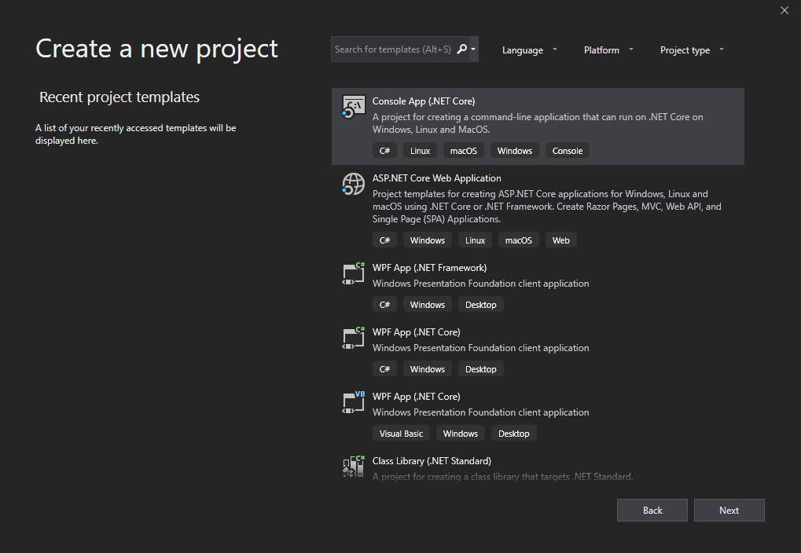
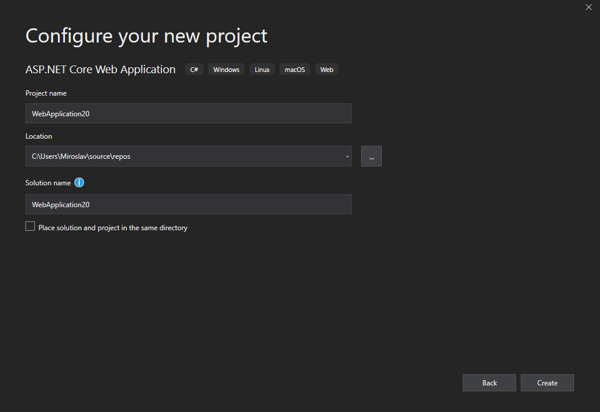
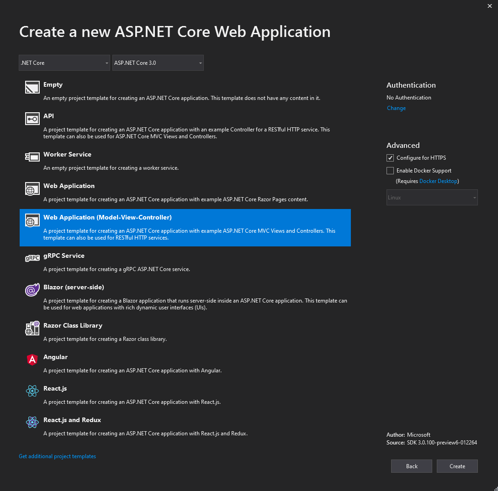
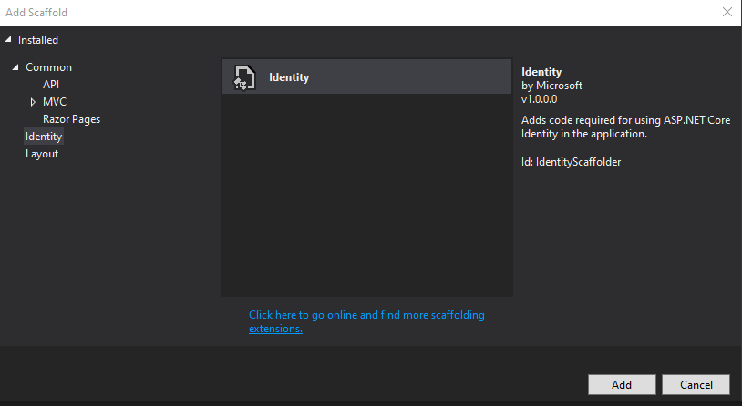
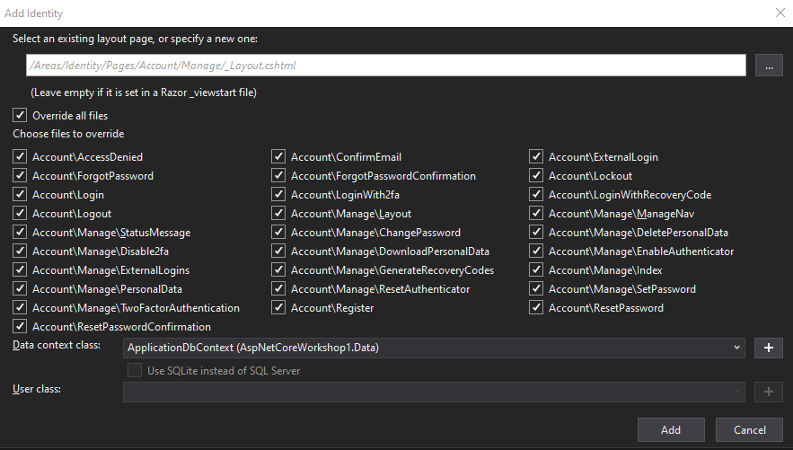

# Tools and templates

In this part, we will get familiar with `dotnet` command line interface, Visual Studio 2019 and .NET Core 3.0 templates.

## `dotnet` CLI

We don't need to have Visual Studio in order to develop .NET Core applications. All we need is `dotnet` CLI and some kind of a text editor.

This CLI is a kind of a driver for command line .NET Core tools. Mode details about it can be found in [documentation](https://docs.microsoft.com/en-us/dotnet/core/tools/?tabs=netcore2x).

### Console app template

Let's see how the things will work if we use CLI only. To kick things out, open your shell (Command Prompt, PowerShell, Windows Terminal, or something else), navigate to a folder where you want your project to be created and run the following command:

    dotnet new console

This will create a new .NET Core console application. It's a simple hello world app that you can run with the following command:

    dotnet run

The output in console will be "Hello World!".

To open it in Visual Studio Code (assuming you have it installed), just run:

    code .

It will start Visual Studio Code in the current folder and show all the files and folder structure. Check how the `.csproj` file looks like.

To see the list of all available templates, run `dotnet new` without arguments:

    dotnet new

### ASP.NET Core templates

Let's try another template:

    dotnet new web

This will create a new empty ASP.NET Core web application. Open it in Visual Studio Code or another editor to check which files it had created. Compare those with the ASP.NET Core introduction we had in the previous part.

A step further would be a template with some additional logic:

    dotnet new webapi

This will create a new ASP.NET Core Web API project. It is the template that we will use the most in our workshop. For now, you can check what it is made of. Especially the `Startup` class and `ValuesController`.

Next template to try, but this time with additional options:

    dotnet new mvc --auth Individual

MVC template will create a lot more files, and in addition, we have also asked for Individual authentication to be provided. This ASP.NET Core MVC project will have ASP.NET Core Identity initialized and ready to go. If you run the application, you can register a new user, log in, modify user data, etc. This template is using Bootstrap to define layout and style of the application.

Open the project in Visual Studio or Visual Studio Code and compare the structure and files with the introduction we had in the previous part of workshop. You should already recognized some concepts that we have mentioned there.

Other templates you can try are `angular`, `react`, `grpc`, `worker` and `serversideblazor`.

## Visual Studio 2019

### New Project dialog

The latest version of Visual Studio has a new redesigned New Project dialog where you can pick and configure all the templates we have mentioned above, when we tried `dotnet` CLI.

When creating a new project in Visual Studio, you have the ability to select the location and define a solution name. Solution is a collection of projects.

In the current preview of .NET Core 3.0, all ASP.NET Core project templates, together with Grpc and Worker, are under *ASP.NET Core Web Application* group. They are also available separately. Use the filter on top to narrow the search.

*Empty* and *API* projects are the templates that we have previously created with `dotnet new web` and `dotnet new webapi` CLI commands. *Web Application (Model-View-Controller)* is the MVC template we used before with `dotnet new mvc` CLI command. *Web Application* is a Razor Pages template. The concept is similar to MVC template, but it's been using events handling model, instead of request response. You can find more about Razor Pages in the [documentation](https://docs.microsoft.com/en-us/aspnet/core/razor-pages/?view=aspnetcore-3.0&tabs=visual-studio). Other templates should be self explanatory.

You can notice options on the right side of dialog. Not all templates support these options.

With *Authentication*, you select how users would be authenticated in your application - No Authentication, Individual User Account, Work or School Account or Windows Authentication. *Individual User Account* is an option that we have used above when creating new MVC application via CLI: `dotnet new mvc --auth Individual`.

*Configure for HTTPS* allow your application to support (and favor) HTTPS protocol, in addition to HTTP.

*Enable Docker Support* adds support for Docker containers. More on that at the end of the workshop.

### Analyzing templates

For initial analysis, it's best to go with MVC template first, with Individual authentication enabled, as it contains a lot of functionality. Same as for CLI, you can compare the structure and files with the introduction we had in the previous part of workshop.

ASP.NET Core Identity has a default implementation of the views hidden (embedded in a dependent package), but you can override any page that you want. To do so, you first need to scaffold the page that should be overridden. You can do that by right clicking on the project, choosing *Add* and then *New Scaffold Item*. Select *Identity* on the left list.

Next dialog will enable you to choose which files you want to override (i.e. Login page). Since we are analyzing the solution, let's enable everything! Also, select the data context class that you already have in the project and click *Add*.

This will generate a lot of files under your Identity area. Note that ASP.NET Core Identity pages are implemented using Razor Pages that we have mentioned above.

A specially interesting file is `Account\Manage\EnableAuthenticator.cshtml`. It contains the instruction on how to add third-party QR-code generator. Use that as an exercise.

Running the application is as simple as pressing `F5` key. With it, a debugger will be started and the application will run under IIS Express server (by default). The defaults are different when project is created from the CLI without specifying any arguments.

-------

Next: [Choosing domain](03-choosing-a-domain.md)
