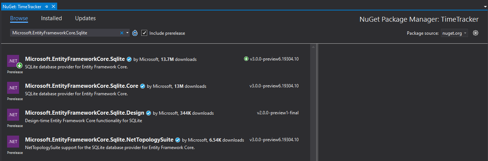

# Domain models and database

In this part we'll finally start to implement the meat of our API - our domain logic. Notice however, that the domain is kept rather simple in order to have focus on ASP.NET Core itself, and its features. Because of this, the domain logic is small or non-existent and our domain models might look [anemic](https://martinfowler.com/bliki/AnemicDomainModel.html).

## Domain models

As a first step, let's create the classes that will form our domain model. As we have mentioned in [previous part](03-choosing-a-domain.md), we are going with Time Tracker application, so let's repeat our user stories here:

- As a user, I want to create new time tracking entry by entering date, client, project, hours and description
- As a user I want to view a list of time tracking entries per month, with a summary of hours and earnings
- As a user I want to manage, add and delete clients and projects
- As a user I want to define future hour rate

All domain classes will be added to `Domain` folder/namespace. Time tracking entries are per user. First thing, we need `User` class to represent our user:

```c#
public class User
{
    public long Id { get; set; }

    [Required]
    public string Name { get; set; }

    public decimal HourRate { get; set; }
}
```

`Id` property is a unique identifier for the entity. All our domain entities will have it. It will be auto-generated in the database.

We are marking the `Name` property with `[Required]` attribute to disallow `null` values when mapping it to database.

`HourRate` marks the current hourly rate for the user. It will be the default value when creating new time tracking entries, and can be changed for future entries.

Other domain entities that we have mentioned in user stories are `Client` and `Project`, where Project belongs to a Client.

```c#
public class Client
{
    public long Id { get; set; }

    [Required]
    public string Name { get; set; }
}
```

```c#
public class Project
{
    public long Id { get; set; }

    [Required]
    public string Name { get; set; }

    [Required]
    public Client Client { get; set; }
}
```

Finally, let's have our time tracking entry defined.

```c#
public class TimeEntry
{
    public long Id { get; set; }

    [Required]
    public User User { get; set; }

    [Required]
    public Project Project { get; set; }

    public DateTime EntryDate { get; set; }

    public int Hours { get; set; }

    public decimal HourRate { get; set; }

    [Required]
    public string Description { get; set; }
}
```

We can have multiple time entries per day. One time entry per user and project. `Hours` property is to define how many hours are spent that day on a particular project. Only integer values are allowed - we are billing each started hour :). `HourRate` property is there to mark the hourly rate for that particular date. If the user's `HourRate` is changed in future, it won't affect existing values in `TimeEntry`.

## Database

Since this workshop is focused on ASP.NET Core and not on database development, for now we're going to use SQLite database. It doesn't require any additional installation for a database server - like more advanced database systems (SQL Server, PostgreSQL, ...).

To start, create a new empty file named `app.db` in the root of your project: `src\TimeTracker\app.db`. You can do that from the Explorer. Right click on folder, select *New > Text Document (.txt)*, and name it `app.db`.

Our application need to know where the database is in order to use it. For that, we need connection string defined. Open `appsettings.json` file and add the following above the `"Logging": {` line:

```json
  "ConnectionStrings": {
    "DefaultConnection": "DataSource=app.db"
  },
```

## Entity Framework Core

In order to use access database, we will use [Entity Framework Core](https://docs.microsoft.com/en-us/ef/core/). EF Core is an object-relational mapper (O/RM), enabling .NET developers to work with a database using .NET objects, and eliminating the need for most of the data-access code they usually need to write. We won't go into EF Core details here, as it's not our focus. You just need to know that EF Core is an ORM that knows how to map your domain objects into database tables. We will configure it to use our database and write some code to read from and write to the database.

For now, let's install EF Core via NuGet. We'll install SQLite provider for EF Core which will in turn install EF Core as a dependency. Installing the NuGet package can be done through Visual Studio interface, NuGet Package Manager Console, .NET CLI tool which we already saw (`dotnet add package ...`), etc. Alternatively, it can be added manually to `.csproj` file. We'll use Visual Studio NuGet Package Manager interface for now.

Right click on project in *Solution Explorer*, select *Manage NuGet Packages...*. Type `Microsoft.EntityFrameworkCore.Sqlite` on the *Browse* tab. Click *Install* on the correct package.



In addition to that package, we also need `Microsoft.EntityFrameworkCore.Tools` so find it and install it too.

Now we need to create a `DbContext` class. `DbContext` instance represents a session with the database and can be used to query and save instances of your entities. DbContext is a combination of the Unit Of Work and Repository patterns (DDD [Domain-Driven Design](https://en.wikipedia.org/wiki/Domain-driven_design) concepts). Basically, with it, we define what entities to map to the database. First create a `Data` folder in the project and then add the following class to it:

```c#
public class TimeTrackerDbContext : DbContext
{
    public TimeTrackerDbContext(DbContextOptions<TimeTrackerDbContext> options)
        : base(options)
    {
    }

    public DbSet<Client> Clients { get; set; }
    public DbSet<Project> Projects { get; set; }
    public DbSet<TimeEntry> TimeEntries { get; set; }
    public DbSet<User> Users { get; set; }
}
```

Our `TimeTrackerDbContext` inherits from base `DbContext` and initialize some options in the constructor.

Finally, open your `Startup` class and add the following at the top of your `ConfigureServices` method to add our class to service registration and enable it for dependency injection:

```c#
services.AddDbContext<TimeTrackerDbContext>(options =>
    options.UseSqlite(Configuration.GetConnectionString("DefaultConnection")));
```

Done, we have set up our database!

## Migrations

While working with databases, it's a good practice not to expect that the database exists and is up to date with the current schema (database objects) the application is using. When working with EF Core, we can use EF Core Migrations to create initial schema of our database and to version it throughout all the changes we have in our domain model. E.g. if we add a new property to our domain model class, we also need to have a new column in the corresponding database table.

EF Core Migrations are done using EF Core tools and we need to install them. We'll do a local tool installation. Since we haven't used tools before in our project, let's first create a tool manifest file. `dotnet-tools.json` manifest file will contain info about all the tools our application is using and their versions.

Open command line and go to the root of our solution (where the solution file is). Run the following command:

    dotnet new tool-manifest

It will create a new manifest file. You only need to do this once, no matter how many tools you will be using in your project.

Next, run the following command to install EF CLI tool:

    dotnet tool install dotnet-ef

Now, navigate to the project directory `src\TimeTracker\` and run this command:

    dotnet ef migrations add "InitialMigration" --output-dir "Data/Migrations"

It will create an initial migration class in `Data\Migrations` folder/namespace. Take some time to look at the content of migration class.

 Whenever your domain changes, you should create a migration. All migrations should go to this folder. Now when you need to recreate the database, or update existing database to the latest version, you can just run the following command. If you do it now, it will create an initial database structure.

    dotnet ef database update

At this point, it would be good to have [SQLite/SQL Server Compact Toolbox](https://marketplace.visualstudio.com/items?itemName=ErikEJ.SQLServerCompactSQLiteToolbox) Visual Studio extension installed (or some other SQLite management tool), in order to validate the content of your database.

## Data seeding

OK, we have the database ready, but we are still missing data in it. It would be nice to have some initial data ready when starting with a new database. For that purpose, we can use data seeding. There's a built in way for [data seeding](https://docs.microsoft.com/en-us/ef/core/modeling/data-seeding) in Entity Framework Core that we will use.

Open the `TimeTrackerDbContext` class and add the following override to it:

```c#
protected override void OnModelCreating(ModelBuilder modelBuilder)
{
    base.OnModelCreating(modelBuilder);

    modelBuilder.Entity<User>().HasData(
        new User { Id = 1, Name = "John Doe", HourRate = 25m },
        new User { Id = 2, Name = "Joan Doe", HourRate = 30m });

    modelBuilder.Entity<Client>().HasData(
        new Client { Id = 1, Name = "Client 1" },
        new Client { Id = 2, Name = "Client 2" });

    modelBuilder.Entity<Project>().HasData(
        new { Id = 1L, Name = "Project 1", ClientId = 1L },
        new { Id = 2L, Name = "Project 2", ClientId = 1L },
        new { Id = 3L, Name = "Project 3", ClientId = 2L });

    modelBuilder.Entity<TimeEntry>().HasData(
        new
        {
            Id = 1L,
            UserId = 1L,
            ProjectId = 1L,
            EntryDate = new DateTime(2019, 7, 1),
            Hours = 5,
            HourRate = 25m,
            Description = "Time entry description 1"
        },
        new
        {
            Id = 2L,
            UserId = 1L,
            ProjectId = 2L,
            EntryDate = new DateTime(2019, 7, 1),
            Hours = 2,
            HourRate = 25m,
            Description = "Time entry description 2"
        },
        new
        {
            Id = 3L,
            UserId = 1L,
            ProjectId = 3L,
            EntryDate = new DateTime(2019, 7, 1),
            Hours = 1,
            HourRate = 25m,
            Description = "Time entry description 3"
        },
        new
        {
            Id = 4L,
            UserId = 2L,
            ProjectId = 3L,
            EntryDate = new DateTime(2019, 7, 1),
            Hours = 8,
            HourRate = 30m,
            Description = "Time entry description 4"
        });
}
```

OK, now that we have at least some seed data, let's generate the migration for it. Run the following command to create migration:

    dotnet ef migrations add "SeedData" --output-dir "Data/Migrations"

Finally, run this command to update the database:

    dotnet ef database update

At this point we have our domain model ready. We also have the database ready with at least some initial data.

-------

Next: [Controllers and actions](06-controllers-and-actions.md)
