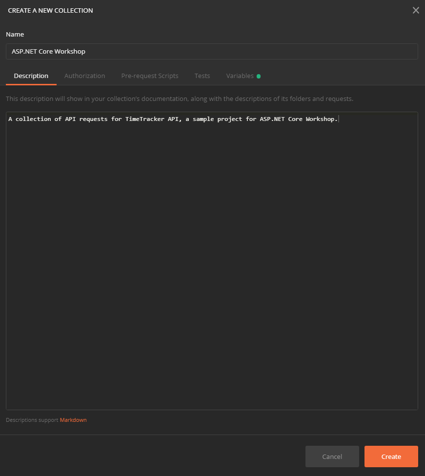
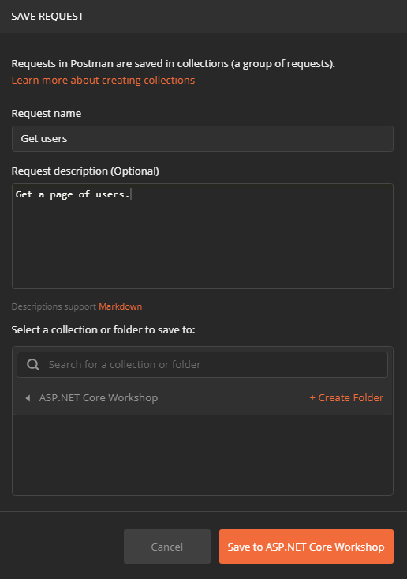
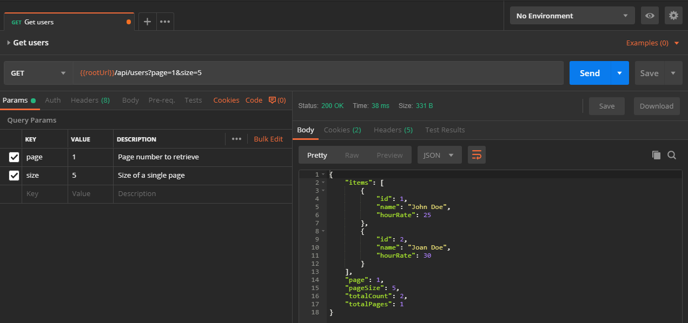
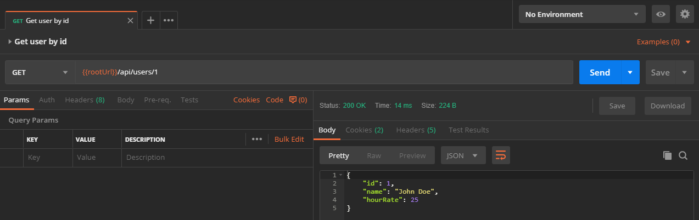
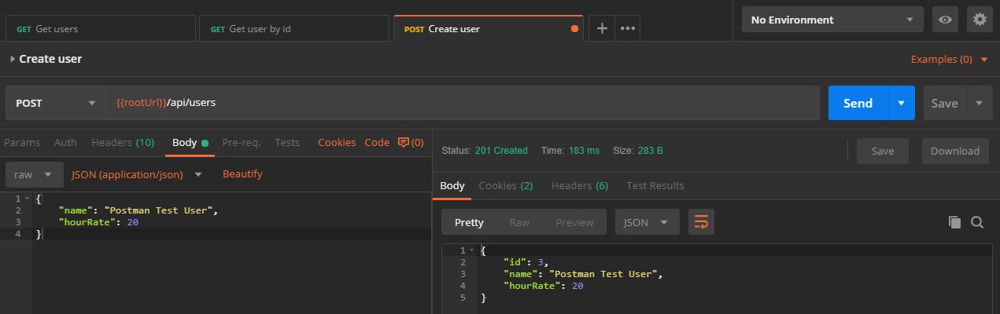
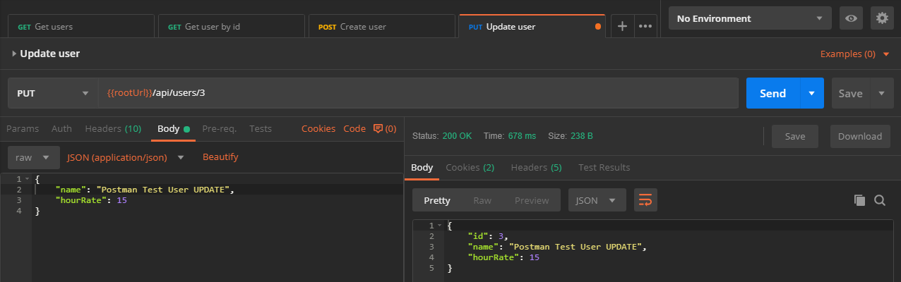
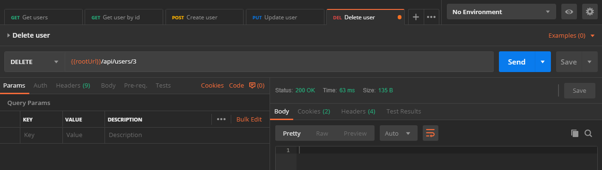
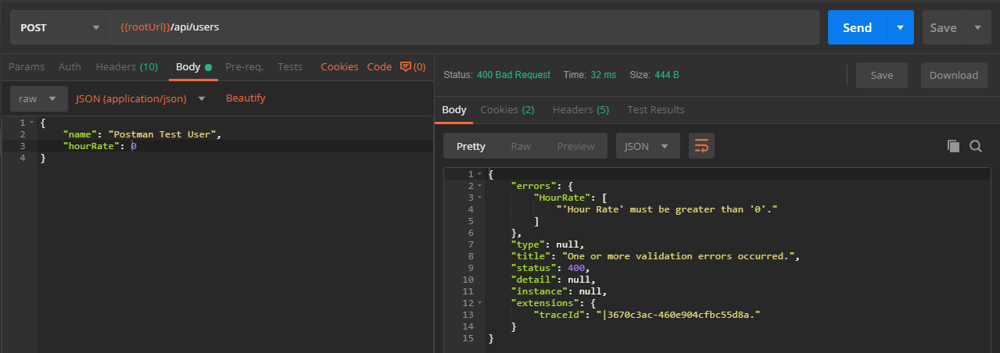

# Controllers and actions

And view models, and data access, and data validation... oh my.

In this part, we'll fully implement the business logic of our API.

## View models

In the previous part, we have implemented our domain models / entities. Domain models contain the data and business logic. In our case, they are persisted to database using Entity Framework Core.

So what are view models then and why do we need them?

No matter how you call them - input models, display models, view models, DTOs (data transfer objects), requests, responses, etc., they are here to create a projection or a subset of domain models to be sent to or received from the clients. The name *view models* comes from MVC, where we have Views, and the models are specific and fulfill the need of views.

In most cases, we don't want clients to have access to all data that we have saved in database, nor do we want clients to update that data, at least not all clients. E.g. if you have `User` class and on it `IsAdmin` property, you don't want the unauthorized user/client to update set it to `true`. You might allow the user to change its profile image and description, but not whether he's an admin or not. For a real world scenario, check out [this article](https://arstechnica.com/information-technology/2012/03/hacker-commandeers-github-to-prove-vuln-in-ruby/) about exploiting similar vulnerability in Ruby on Rails.

Beside creating a subset of data, we often need to transform the data sent or received from clients. I.e. in our case, `Project` class has a `Client` property of type `Client`. When creating a new project, we want the API client to send `ClientId` only, not the full `Client` object. Another case - if we want to display the `HourRate` for `User`, we might want to do so in different currency than the one we have in our db. We might contact the currency exchange API on server, do a conversion, and send formatted hour rate `27.60 €` to the API client, even though the rate is saved as dollar amount in database.

Let's see what view models we need for our API. We'll create them in `Models` namespace. We'll also use `Model` (for response data sent to API client) and `InputModel` (for request data from API client) suffixes.

`User` and `Client` domain models are pretty simple, so it will be easy to create view models for them.

```c#
public class UserModel
{
    public long Id { get; set; }
    public string Name { get; set; }
    public decimal HourRate { get; set; }

    public static UserModel FromUser(User user)
    {
        return new UserModel
        {
            Id = user.Id,
            Name = user.Name,
            HourRate = user.HourRate
        };
    }
}
```

```c#
public class UserInputModel
{
    public string Name { get; set; }
    public decimal HourRate { get; set; }

    public void MapTo(User user)
    {
        user.Name = Name;
        user.HourRate = HourRate;
    }
}
```

```c#
public class ClientModel
{
    public long Id { get; set; }
    public string Name { get; set; }

    public static ClientModel FromClient(Client client)
    {
        return new ClientModel
        {
            Id = client.Id,
            Name = client.Name
        };
    }
}
```

```c#
public class ClientInputModel
{
    public string Name { get; set; }

    public void MapTo(Client client)
    {
        client.Name = Name;
    }
}
```

Notice how we only need `Id` property in models returned as a response to API client. That's because the id might be used for the next operation - if client decides to delete or update the existing `User` or `Client`, or use those when creating or modifying `TimeEntry` objects.

`FromUser` and `FromClient` static methods are there to help map / convert from domain model to view model. `MapTo` methods are there to map property values from view model to domain model.

Now let's create the view models for `Project`.

```c#
public class ProjectModel
{
    public long Id { get; set; }
    public string Name { get; set; }
    public long ClientId { get; set; }
    public string ClientName { get; set; }

    public static ProjectModel FromProject(Project project)
    {
        return new ProjectModel
        {
            Id = project.Id,
            Name = project.Name,
            ClientId = project.Client.Id,
            ClientName = project.Client.Name
        };
    }
}
```

```c#
public class ProjectInputModel
{
    public string Name { get; set; }
    public long ClientId { get; set; }

    public void MapTo(Project project)
    {
        project.Name = Name;
    }
}
```

For `ProjectModel` we have two properties for the associated client, `ClientId` and `ClientName`. `ClientId` is necessary if we want to modify the `Project`, in `ProjectInputModel` - we can change the client it belongs to. `ClientName` is there just to help with display purposes. E.g. if we want to display a list of all projects, with the clients associated with them. Note how we initialize those properties in `FromProject` method. Also note that in `MapTo` method we don't set the `project.Client` property, because we only have `ClientId` value. It will be done later from the controller which has access to `DbContext` to load the `Client` instance.

Finally, let's create view models for `TimeEntry` which is our most complicated domain model.

```c#
public class TimeEntryModel
{
    public long Id { get; set; }
    public long UserId { get; set; }
    public string UserName { get; set; }
    public long ProjectId { get; set; }
    public string ProjectName { get; set; }
    public long ClientId { get; set; }
    public string ClientName { get; set; }
    public DateTime EntryDate { get; set; }
    public int Hours { get; set; }
    public decimal HourRate { get; set; }
    public string Description { get; set; }

    public static TimeEntryModel FromTimeEntry(TimeEntry timeEntry)
    {
        return new TimeEntryModel
        {
            Id = timeEntry.Id,
            UserId = timeEntry.User.Id,
            UserName = timeEntry.User.Name,
            ProjectId = timeEntry.Project.Id,
            ProjectName = timeEntry.Project.Name,
            ClientId = timeEntry.Project.Client.Id,
            ClientName = timeEntry.Project.Client.Name,
            EntryDate = timeEntry.EntryDate,
            Hours = timeEntry.Hours,
            HourRate = timeEntry.HourRate,
            Description = timeEntry.Description
        };
    }
}
```

```c#
public class TimeEntryInputModel
{
    public long UserId { get; set; }
    public long ProjectId { get; set; }
    public DateTime EntryDate { get; set; }
    public int Hours { get; set; }
    public string Description { get; set; }

    public void MapTo(TimeEntry timeEntry)
    {
        timeEntry.EntryDate = EntryDate;
        timeEntry.Hours = Hours;
        timeEntry.Description = Description;
    }
}
```

Again, `TimeEntryModel` has multiple properties for each related entity, even for `Client`. `TimeEntry` only has `Project` property, and `Project` has `Client` property. However, for convenience, we have `ClientId` and `ClientName` properties on our `TimeEntryModel`.

There's no `TimeEntryInputModel.HourRate` property here, as we will initialize `TimeEntry.HourRate` from `User.HourRate`. API client cannot set that value.

### Paging support

While we are here, let's add another view model that will help us to do paging. Why do we need paging anyway? Well, we don't want to return an entire content of database table to the API client. There might be thousands, or hundreds of thousands of rows. We only need to return a subset. One page of result with predefined page size.

```c#
public class PagedList<T>
{
    public IEnumerable<T> Items { get; set; }
    public int Page { get; set; }
    public int PageSize { get; set; }
    public int TotalCount { get; set; }
    public int TotalPages => (int) Math.Ceiling((double) TotalCount / PageSize);
}
```

This generic class above allows us to return a subset of all items in database through the `Items` property. It also returns current `Page` number, `PageSize`, `TotalCount` in database and `TotalPages`.

## Validation

Data coming from outside, from the user or from the API client, should never be trusted. It needs to be validated. Some properties are required, others must be between a range of values, or use a specific format, etc. For data validation in ASP.NET Core, we have built-in support, using [data annotations](https://docs.microsoft.com/en-us/aspnet/core/mvc/models/validation?view=aspnetcore-3.0). It has a number of built-in attributes that you can use on your model properties. We have already used `[Required]` attribute on our domain model properties, since Entity Framework Core can support those and automatically make database column non-nullable. There are also `[Range]`, `[StringLength]`, `[Phone]`, `[EmailAddress]`, etc. You can also write your own custom validation attributes. ASP.NET Core automatically recognizes those and handles validation, returning proper response to the API client in case of validation errors.

There are also other ways for doing validation, and we are going to use an alternative method instead, with the help of [FluentValidation](https://fluentvalidation.net/) library. Instead of modifying our models by adding attributes to properties, FluentValidation is using satellite classes as validations. This really helps with separation of concerns and is much more flexible, especially when you need to implement a custom validation logic, not supported by built in validators.

Install `FluentValidation.AspNetCore` [NuGet package](https://www.nuget.org/packages/FluentValidation.AspNetCore/), version 8.5+, since the support for ASP.NET Core 3.0 is added in 8.5.

OK, now we can start writing our validation logic. We do that by adding validator classes inheriting from `AbstractValidator<T>`. Let's write first of them under `Models.Validation` namespace:

```c#
public class UserInputModelValidator : AbstractValidator<UserInputModel>
{
    public UserInputModelValidator()
    {
        RuleFor(x => x.Name)
            .NotEmpty()
            .Length(1, 100);

        RuleFor(x => x.HourRate)
            .GreaterThan(0)
            .LessThan(1000);
    }
}
```

The validator classes in our case will be pretty simple, but you can see that adding rules to properties is pretty self-explanatory and would work for more complex cases. Validators are defined per class that needs to be validated. In the code above, that's `UserInputModel`. Of course, we only need to validate input models, since those are coming from the API client / user.

We use `RuleFor` to select the property on our class and the use [fluent interface](https://martinfowler.com/bliki/FluentInterface.html) to add rules. `NotEmpty` rule forbids `null` and empty string on `Name`. `Length` defines that our `Name` property can only have value that is between 1 and 100 characters long. `GreaterThan` and `LessThen` are limiting the range of value on `HourRate` property.

Create other validators too:

```c#
public class ClientInputModelValidator : AbstractValidator<ClientInputModel>
{
    public ClientInputModelValidator()
    {
        RuleFor(x => x.Name)
            .NotEmpty()
            .Length(1, 100);
    }
}
```

```c#
public class ProjectInputModelValidator : AbstractValidator<ProjectInputModel>
{
    public ProjectInputModelValidator()
    {
        RuleFor(x => x.Name)
            .NotEmpty()
            .Length(1, 100);

        RuleFor(x => x.ClientId)
            .NotEmpty();
    }
}
```

```c#
public class TimeEntryInputModelValidator : AbstractValidator<TimeEntryInputModel>
{
    public TimeEntryInputModelValidator()
    {
        RuleFor(x => x.UserId)
            .NotEmpty();

        RuleFor(x => x.ProjectId)
            .NotEmpty();

        RuleFor(x => x.EntryDate)
            .GreaterThan(new DateTime(2019, 1, 1))
            .LessThan(new DateTime(2100, 1, 1));

        RuleFor(x => x.Hours)
            .InclusiveBetween(1, 24);

        RuleFor(x => x.Description)
            .NotEmpty()
            .MaximumLength(10000);
    }
}
```

When we use `NotEmpty` rule on `int` or `long` property, it basically mean that the default value of `0` is not allowed.

There are multiple rules for defining ranges and they are pretty flexible. We can have date ranges, we can use `GreaterThan`, `LessThan`, `InclusiveBetween` and `ExclusiveBetween`.

Beside built in validation rules, you can also define your own predicate rules with `Must` and custom validators. Check the [documentation](https://fluentvalidation.net/custom-validators) for samples.

The final step for validation is to let the ASP.NET Core know about these validators. Open your `Startup` class and modify the `service.AddControllers()` line to this:

```c#
services.AddControllers().AddFluentValidation(
    fv => fv.RegisterValidatorsFromAssemblyContaining<UserInputModelValidator>());
```

That's it. Your input models will now be properly validated.

## Data access considerations

Before we start implementing our controllers, we should take a moment to consider how would we access the database from the controller. Here are few options with pros and cons.

### 1. Using `DbContext` class directly

This is the most simple case, and hence we will use that in our sample. The con is that we won't be able to do proper unit testing, but more on that in a future part.

### 2. Using repositories

[Repository](https://martinfowler.com/eaaCatalog/repository.html) is a design pattern used when doing DDD (domain-driven design). It provides a collection-like interface for accessing domain object. Here's how the repository for our `User` domain model would look like:

```c#
public class UserRepository
{
    private readonly TimeTrackerDbContext _context;

    public UserRepository(TimeTrackerDbContext context)
    {
        _context = context;
    }

    public async Task<IEnumerable<User>> GetAll()
    {
        return await _context.Users.ToListAsync();
    }

    public async Task<User> GetById(long id)
    {
        return await _context.Users.FindAsync(id);
    }

    public async Task Add(User user)
    {
        await _context.Users.AddAsync(user);
        await _context.SaveChangesAsync();
    }

    public async Task Update(User user)
    {
        _context.Users.Update(user);
        await _context.SaveChangesAsync();
    }

    public async Task Delete(User user)
    {
        _context.Users.Remove(user);
        await _context.SaveChangesAsync();
    }
}
```

You can see that it more or less just passes the calls through to internal `DbContext` class. Another problem with the code above is that it calls `SaveChangesAsync` method on each add, update and delete, meaning it would prevent us to create unit of work with multiple objects added, updated or deleted under a single transaction.

Remember when we talked about Entity Framework Core's `DbContext` in the previous part? We said that `DbContext` is a mix of unit of work and repository pattern. So repository pattern in our case would just abstract away repository implementation that's already in `DbContext`. There is a lot of community talk around that. Take a look at [this blog post and comments](https://lostechies.com/derekgreer/2018/02/20/ditch-the-repository-pattern-already/) for instance.

The repository above could easily become generic one to handle any domain model and specific implementations would inherit from it. However, that's considered even [a bigger anti-pattern](https://rob.conery.io/2014/03/03/repositories-and-unitofwork-are-not-a-good-idea/).

So, as a conclusion, consider whether you really need Repository pattern in your code, especially if you are using an ORM like Entity Framework Core.

### 3. Using CQRS pattern

[Command Query Responsibility Segregation](https://martinfowler.com/bliki/CQRS.html) is a pattern that gives you a notion about using different model to update information than the model you use to read information (similar to what we already have with our view models).

In ASP.NET Core, we can use a library like [MediatR](https://github.com/jbogard/MediatR), which allows us to write our logic for processing inputs and providing outputs in separate handlers. Learn more in [documentation](https://github.com/jbogard/MediatR/wiki).

As with repositories, it is out of the scope of this workshop, but it's good to be aware of these patterns. They are used a lot within ASP.NET Core community.

## Controllers

It is finally a time to start implementing our controllers and action methods on them. We'll start with a simpler controller first, `UsersController`.

### Users controller

```c#
[ApiController]
[Route("/api/users")]
public class UsersController : Controller
{
    private readonly TimeTrackerDbContext _dbContext;
    private readonly ILogger<UsersController> _logger;

    public UsersController(TimeTrackerDbContext dbContext, ILogger<UsersController> logger)
    {
        _dbContext = dbContext;
        _logger = logger;
    }
}
```

`UsersController` inherits from base `Controller` class which provides some useful functionality. It's also marked with `[ApiController]` attribute which enables API conventions to kick in, like better handling of action method parameters (model binding). One of the things that `[ApiController]` attribute brings is automatic validation of input which works just fine with our FluentValidation-based code. It will trigger error `400` in case of validation rules reporting errors.

`[Route("/api/users")]` defines the default route (URL) for the controller action methods. This allows us to define relative routes on action methods.

We are using constructor dependency injection in the code above, to get an instance of `DbContext` class and logger. We save both to instance fields to be used later.

Now to adding our action methods. First one will be for retrieving a single `User` by id:

```c#
[HttpGet("{id}")]
public async Task<ActionResult<UserModel>> GetById(long id)
{
    _logger.LogDebug($"Getting a user with id {id}");

    var user = await _dbContext.Users.FindAsync(id);

    if (user == null)
    {
        return NotFound();
    }

    return UserModel.FromUser(user);
}
```

This is an HTTP `GET` method and it's full URL is `/api/users/{id}`.

The method is async, which is a good practice, especially when doing database access code. `DbContext` has async methods for all operations. The return type of the method is `ActionResult<UserModel>`. This type allows us to return not just an instance of the `UserModel` class but also some HTTP status codes, like `404` when we cannot find the `User` in database.

We first do debug logging, which is another good practice.

After that, we are calling `FindAsync` method on `DbContext`'s `Users` property. If it returns `null`, it means that the user is not found, so we return HTTP status code `404`.

If user is found, we convert it to `UserModel` view model and return back to caller. By default, the caller will get JSON formatted response, but other formats can be registered with ASP.NET Core and provided by content negotiation feature, without us worrying about how to properly format the response.

Next action method will be for retrieving a page of users from the database:

```c#
[HttpGet]
public async Task<ActionResult<PagedList<UserModel>>> GetPage(int page = 1, int size = 5)
{
    _logger.LogDebug($"Getting a page {page} of users with page size {size}");

    var users = await _dbContext.Users
        .Skip((page - 1) * size)
        .Take(size)
        .ToListAsync();

    return new PagedList<UserModel>
    {
        Items = users.Select(UserModel.FromUser),
        Page = page,
        PageSize = size,
        TotalCount = await _dbContext.Users.CountAsync()
    };
}
```

It is also an HTTP `GET` method and it will use default URL defined on controller - `/api/users`.

The method accepts `page` and `size` parameters, but provides defaults for them, in case they are not provided in request query string. When they are provided, the URL looks like this: `/api/users?page=1&size=10`.

`page` and `size` are used when loading the users from `DbContext` by skipping previous pages and taking page size of items, and also to set the properties of `PagedList<UserModel>` instance.

Notice also that we map the returned users into `UserModel` by using `FromUser` method in LINQ's `Select`.

Next method is for deleting a single `User` by id value:

```c#
[HttpDelete("{id}")]
public async Task<IActionResult> Delete(long id)
{
    _logger.LogDebug($"Deleting user with id {id}");

    var user = await _dbContext.Users.FindAsync(id);

    if (user == null)
    {
        return NotFound();
    }

    _dbContext.Users.Remove(user);
    await _dbContext.SaveChangesAsync();

    return Ok();
}
```

This time we are using HTTP `DELETE` method and URL will be `/api/users/{id}`.

The method accepts `id` as a parameter, checks for user existence in db and returns `404` if user is not found. The return type of the method is `IActionResult` this time, since we don't need to return view model, only status codes.

After removing user from `DbContext`, we need to apply the changes to database using `SaveChangesAsync` call. This call will be used for create and update methods too.

If deleting is successful, an HTTP status code `200` is returned, using method `Ok`.

Here are the final two methods of `UserController`:

```c#
[HttpPost]
public async Task<ActionResult<UserModel>> Create(UserInputModel model)
{
    _logger.LogDebug($"Creating a new user with name {model.Name}");

    var user = new Domain.User();
    model.MapTo(user);

    await _dbContext.Users.AddAsync(user);
    await _dbContext.SaveChangesAsync();

    var resultModel = UserModel.FromUser(user);

    return CreatedAtAction(nameof(GetById), "users", new {id = user.Id}, resultModel);
}

[HttpPut("{id}")]
public async Task<ActionResult<UserModel>> Update(long id, UserInputModel model)
{
    _logger.LogDebug($"Updating user with id {id}");

    var user = await _dbContext.Users.FindAsync(id);

    if (user == null)
    {
        return NotFound();
    }

    model.MapTo(user);

    _dbContext.Users.Update(user);
    await _dbContext.SaveChangesAsync();

    return UserModel.FromUser(user);
}
```

These methods are defined as HTTP `POST` and `PUT`. They have `UserInputModel` as parameter. The client will send this in request body using JSON or some other format. Values will be automatically validated by ASP.NET Core, using our validators.

`MapTo` method of `UserInputModel` will be called to map properties of model to the `User` instance that will be saved to database.

Worth noting is that `Create` method returns `CreatedAtAction`, which produces HTTP status code `201 CREATED` and a link to a newly created resource.

At this point, you can start debugging and use browser or Postman to call URLs that we defined so far - `https://localhost:{port}/api/users/`.

### Other controllers

`ClientsController` looks the same. You can check it in source code of this git repository.

`ProjectsController` is slightly more complex, since it needs to handle relation between `Project` and `Client`. This is how `GetById` method looks like:

```c#
[HttpGet("{id}")]
public async Task<ActionResult<ProjectModel>> GetById(long id)
{
    _logger.LogDebug($"Getting a project with id {id}");

    var project = await _dbContext.Projects
        .Include(x => x.Client)
        .SingleOrDefaultAsync(x => x.Id == id);

    if (project == null)
    {
        return NotFound();
    }

    return ProjectModel.FromProject(project);
}
```

Notice how we couldn't use `_dbContext.Projects.FindAsync` this time, since it doesn't allow us to include child properties in the response. Instead, we had to call `Include(x => x.Client)` which will also return the `Client` property filled from the database, and to do `SingleOrDefaultAsync` to get the project by project id.

`GetPage` method looks similar. It also needs `Include` method call:

```c#
[HttpGet]
public async Task<ActionResult<PagedList<ProjectModel>>> GetPage(int page = 1, int size = 5)
{
    _logger.LogDebug($"Getting a page {page} of projects with page size {size}");

    var projects = await _dbContext.Projects
        .Include(x => x.Client)
        .Skip((page - 1) * size)
        .Take(size)
        .ToListAsync();

    return new PagedList<ProjectModel>
    {
        Items = projects.Select(ProjectModel.FromProject),
        Page = page,
        PageSize = size,
        TotalCount = await _dbContext.Projects.CountAsync()
    };
}
```

In `Create` and `Update` methods, we have to load the client separately, since our `ProjectInputModel` only has the `ClientId` property. Here's how the relevant part of `Create` method looks like:

```c#
var client = await _dbContext.Clients.FindAsync(model.ClientId);
if (client == null)
{
    return NotFound();
}

var project = new Project {Client = client};
model.MapTo(project);
```

For `TimeEntriesController` we can use the same pattern for loading and saving `TimeEntry.User` and `TimeEntry.Project` properties. Don't forget to initialize `TimeEntry.HourRate` in `Create` method from `User.HourRate`. You can see the final version of `TimeEntriesController` in this git repository.

## Postman collection

Now that we have all our controllers ready, let's use Postman to create a collection of requests for easy manual testing of our API.

At this point, it would be good to create a Postman account, if you don't have one already. Having an account will enable you to synchronize your collections between multiple machines, as they will be saved in cloud. You can also share your collection with friends and co-workers (limited in free version). In the top right corner of Postman, you'll find the options to log in or create an account.

On the left side of Postman interface, click on *Collections* and then on *+ New Collection*. Provide a meaningful name and description.



Before clicking on *Create*, go to *Variables* tab and create a `rootUrl` variable. Give it the initial value of `https://localhost:44383` (your port will probably be different).


Now let's add some requests to this collection. We'll start from `/api/users`. Right click on your collection and select *Add request*. Name your request *Get users* and click on *Save* button.



Open your request by double clicking it. Enter `{{rootUrl}}/api/users?page=1&size=5` as URL. Note how we are using a Postman variable here that we have defined earlier. This helps us if we later decide to change the port or when we deploy the API - we only need to change the root URL at one place. Create two query parameters - `page` and `size` and give them initial values. If you click *Send* now, you should get the HTTP `200 OK` response (assuming that your project is running). The response body will contain JSON formatted `PagedList<User>`. Don't forget to click *Save*.



Next request to add will be for getting a single user by id.



On to creating a new user. This will be a `POST` request and it needs a body. Under *Body* tab of the request select *raw* and *JSON (application/json)*. JSON properties should match those defined on `UserInputModel`. When you click *Send*, you'll get HTTP `201 Created` response with the newly created user in JSON format returned in body.



Updating existing user will be similar. We need to send `PUT` request but to provide `id` within URL - `{{rootUrl}}/api/users/3`. Sending the request will produce HTTP `200 OK` with the user in the response body or HTTP `404 Not Found` if user doesn't exist in database.



Finally, deleting an existing user is similar to updating, but you don't need fill in the request body this time. Just send HTTP `DELETE` to the same URL.



Creating requests for all other API calls (client, projects and time entries) is similar. You can find the final Postman collection in the root of this git repository.

Tip: Try to test your validation logic now that you have all the API requests in Postman. I.e., trying to create a user with hour rate of 0 will return HTTP `400 Bad Request` with error like this:



## Error handling

We covered a lot in this part, but let's add one more thing. You were able to see that validation errors are returned using a JSON formatted response, but if the API throws the exception at some point, a plain text response from Developer Exception page will be returned (this is to be changed in final version of ASP.NET Core 3.0). The response will look like this:

    System.Exception: Test error handling middleware
    at TimeTracker.Controllers.UsersController.GetPage(Int32 page, Int32 size) in
    ... [cut for brevity]

The output on production won't have as many details, but it will still be in plain text. So let's add a custom error handling middleware that will produce JSON output with standardized error content.

```c#
public class ErrorHandlingMiddleware
{
    private readonly RequestDelegate _next;
    private readonly ILogger<ErrorHandlingMiddleware> _logger;

    public ErrorHandlingMiddleware(RequestDelegate next, ILogger<ErrorHandlingMiddleware> logger)
    {
        _next = next;
        _logger = logger;
    }

    public async Task Invoke(HttpContext context /* other scoped dependencies */)
    {
        try
        {
            await _next(context);
        }
        catch (Exception ex)
        {
            _logger.LogError(ex, ex.Message);

            await HandleExceptionAsync(context, ex);
        }
    }

    private static Task HandleExceptionAsync(HttpContext context, Exception exception)
    {
        var code = HttpStatusCode.InternalServerError; // 500 if unexpected

        //if (exception is NotFoundException) code = HttpStatusCode.NotFound;
        //else if (exception is UnauthorizedException) code = HttpStatusCode.Unauthorized;
        //else if (exception is CustomException) code = HttpStatusCode.BadRequest;

        // Using RFC 7807 response for error formatting
        // https://tools.ietf.org/html/rfc7807
        var problem = new ProblemDetails
        {
            Type = "https://yourdomain.com/errors/internal-server-error",
            Title = "Internal Server Error",
            Detail = exception.Message,
            Instance = "",
            Status = (int)code
        };

        var result = JsonSerializer.Serialize(problem);

        context.Response.ContentType = "application/problem+json";
        context.Response.StatusCode = (int)code;

        return context.Response.WriteAsync(result);
    }
}
```

You can customize the middleware further if you want, but it should be OK for start and also show you how you can build a custom ASP.NET Core middleware.

Add our middleware to the pipeline in `Startup` class, as early as possible. We'll add it just after `app.UseHttpsRedirection();`.

```c#
app.UseHttpsRedirection();

// Inject our custom error handling middleware into ASP.NET Core pipeline
app.UseMiddleware<ErrorHandlingMiddleware>();
```

With this middleware, an exception will produce this response:

```json
{
    "Type": "https://yourdomain.com/errors/internal-server-error",
    "Title": "Internal Server Error",
    "Status": 500,
    "Detail": "Test error handling middleware",
    "Instance": "",
    "Extensions": {}
}
```

-------

Next: [Securing API](07-securing-api.md)
