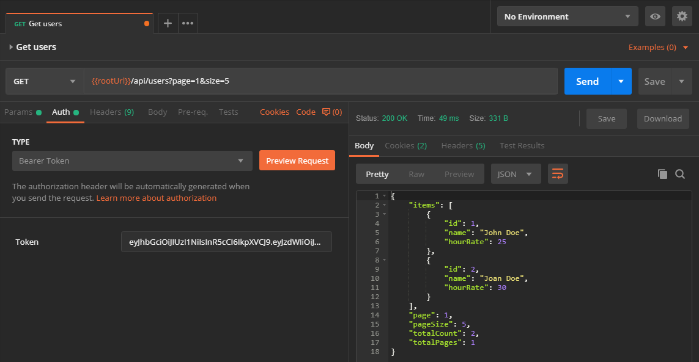
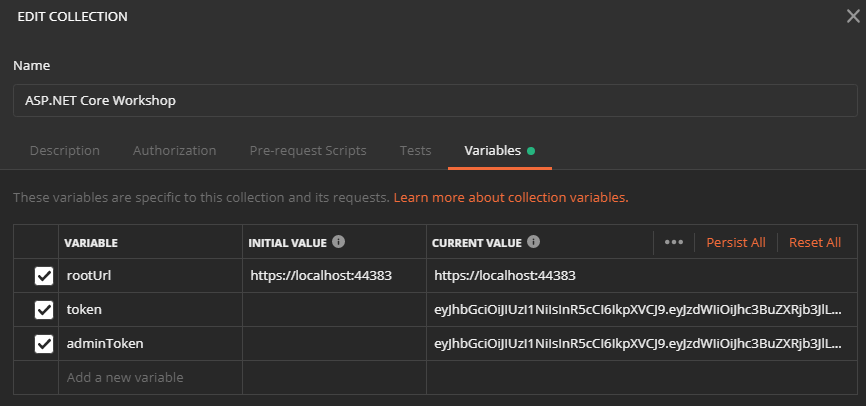
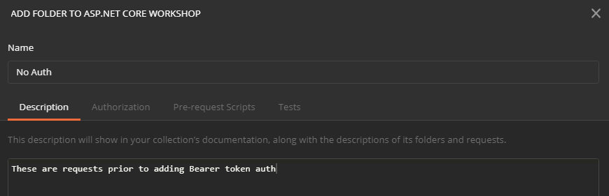
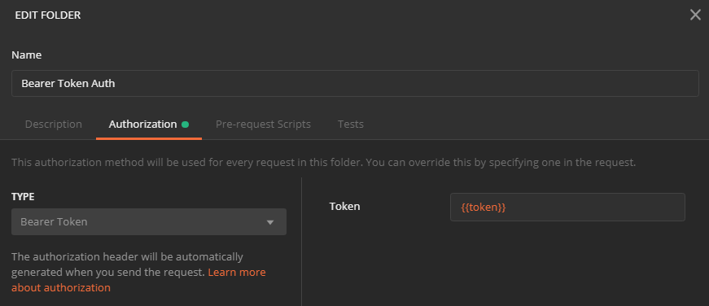
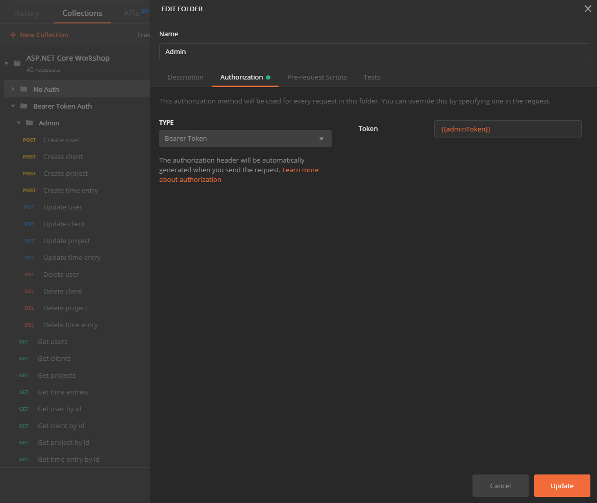

# Securing API

In this part we'll work on securing our API using HTTPS and OAuth 2.0 standard, with JWT tokens.

## HTTPS

All APIs should be served over [HTTPS](https://en.wikipedia.org/wiki/HTTPS) protocol, no matter what data they are serving. In fact, even all the websites [should be served](https://doesmysiteneedhttps.com/) over HTTPS! Today, we can even get [free certificates](https://letsencrypt.org/), so nothing prevents us from using HTTPS everywhere.

Good news! With ASP.NET Core already we already have HTTPS by default, so nothing to do here. Applications created from ASP.NET Core template are served over both HTTP and HTTPS. There's even a redirection middleware defined in `Startup` class that will redirect any HTTP request to HTTPS.

```c#
app.UseHttpsRedirection();
```

Just make a mental note to set up HTTPS on the environment where you will deploy your API / web application. Most cloud providers already have automated HTTPS set up and renewal using Let's Encrypt. There are even some [ASP.NET Core middleware](https://github.com/natemcmaster/LetsEncrypt) that you can use for that purpose.

## OAuth 2.0 and OpenID Connect

[OAuth 2.0](https://oauth.net/2/) is the industry standard protocol for authorization. It provides a number of specific authorization flows for web applications, desktop applications, mobile and other devices.

[OpenID Connect](https://openid.net/connect/) is an identity layer on top of the OAuth 2.0 protocol. It allows clients to verify the identity of the End-User based on the authentication performed by an Authorization Server.

ASP.NET Core supports both OAuth 2.0 and OpenID Connect protocols. We will just enable JWT (JSON Web Token) based authentication on the simplest way possible, since the details of the implementation are out of scope for this workshop.

## Adding JWT token authentication

When adding token authentication, you must provide several parameters, like issuer, audience and key. For our simple project, we'll use our API as both the issuer and audience.

Let's first add these parameters to the `appsettings.json` file:

```json
"Tokens": {
  "Issuer": "http://localhost:44383",
  "Key": "some-long-secret-key"
}
```

JWT authentication support is contained in a separate NuGet [package](https://www.nuget.org/packages/Microsoft.AspNetCore.Authentication.JwtBearer/) which we need to install - `Microsoft.AspNetCore.Authentication.JwtBearer`.

Next step will be to add services necessary for authentication and define token validation parameters. A best practice is not to clutter your `Startup` class, so let's implement that as an extension to `IServiceCollection`, under `Extensions` namespace:

```c#
public static class ServiceCollectionExtensions
{
    public static void AddJwtBearerAuthentication(this IServiceCollection services, IConfiguration configuration)
    {
        services
            .AddAuthentication(JwtBearerDefaults.AuthenticationScheme)
            .AddJwtBearer(
                options =>
                {
                    var tokenValidationParameters = new TokenValidationParameters
                    {
                        ValidIssuer = configuration["Tokens:Issuer"],
                        ValidAudience = configuration["Tokens:Issuer"],
                        IssuerSigningKey =
                            new SymmetricSecurityKey(
                                Encoding.UTF8.GetBytes(configuration["Tokens:Key"]))
                    };

                    options.TokenValidationParameters = tokenValidationParameters;
                });
    }
}
```

We need to call our extension method from `Startup.ConfigureServices`:

```c#
services.AddJwtBearerAuthentication(Configuration);
```

Also, we need to enable authentication middleware in `Startup.Configure`. Add the following just before the authorization middleware:

```c#
app.UseAuthentication();
```

## Protecting controllers and action methods

All our controllers and their action methods should prevent unauthorized access. If the incoming request doesn't container Bearer authorization header `Authorization: Bearer <JWT token>`, the response should be HTTP `401 Unauthorized`. This is already implemented through JWT authentication we have added above. We just need to mark our controllers and action methods with `[Authorize]` attribute to enable it.

Let's add the `[Authorize]` attribute to all our controllers. This will protect all the action methods in those controllers.

```c#
[ApiController]
[Authorize]
[Route("/api/time-entries")]
public class TimeEntriesController : Controller
{
    // ...
}
```

In addition to this, let's require an additional privilege for action methods that are changing data - `DELETE`, `POST` and `PUT`. Mark those methods with `[Authorize(Roles = "admin")]` attribute.

```c#
[Authorize(Roles = "admin")]
[HttpDelete("{id}")]
public async Task<IActionResult> Delete(long id)
{
}
```

If you try to call this method with the valid JWT token, but without `admin` role claim, it will return HTTP `403 Forbidden` response.

At this moment, if you try to make any request from the Postman, you'll get `401 Unauthorized` since we don't provide tokens with the request. Tokens need to be issued by authorization server.

## Authorization server

An important part of the OAuth 2.0 and OpenID Connect protocols is authorization server - a server that will, among other things, validate the user or API client credentials and issue a token. ASP.NET Core doesn't have authorization server built in.

We could use some third-party authorization servers like [Auth0](https://auth0.com/) and [Okta](https://www.okta.com/). They offer free tiers that are good enough for playing around.

We could also build our own authorization server using [IdentityServer4](https://identityserver.io/) or [OpenIddict](https://github.com/openiddict/openiddict-core) framework. In fact, IdentityServer4 support comes built in with SPA templates in ASP.NET Core 3.0.

For now, to keep things simple, let's just simulate the server in our API. The following class will generate JWT tokens for us:

```c#
public static class JwtTokenGenerator
{
    // WARNING: This is just for demo purpose
    public static string Generate(string name, bool isAdmin, string issuer, string key)
    {
        var claims = new List<Claim>
        {
            new Claim(JwtRegisteredClaimNames.Sub, name),
            new Claim(JwtRegisteredClaimNames.Jti, Guid.NewGuid().ToString())
        };
        if (isAdmin) claims.Add(new Claim(ClaimTypes.Role, "admin"));

        var securityKey = new SymmetricSecurityKey(Encoding.UTF8.GetBytes(key));
        var credentials = new SigningCredentials(securityKey, SecurityAlgorithms.HmacSha256);

        var token = new JwtSecurityToken(
            issuer,
            issuer,
            claims,
            // WARNING: You should not use expiration this long
            expires: DateTime.Now.AddDays(365),
            signingCredentials: credentials);

        return new JwtSecurityTokenHandler().WriteToken(token);
    }
}
```

We'll call this generator from a new controller - `DummyAuthController`.

```c#
// DEMO PURPOSE ONLY!
public class DummyAuthController : Controller
{
    private readonly IConfiguration _configuration;

    public DemoTokenController(IConfiguration configuration)
    {
        _configuration = configuration;
    }

    // NOT FOR PRODUCTION USE!!!
    // you will need a robust auth implementation for production
    // i.e. try IdentityServer4
    [AllowAnonymous]
    [Route("/get-token")]
    public IActionResult GenerateToken(string name = "aspnetcore-workshop-demo", bool admin = false)
    {
        var jwt = JwtTokenGenerator
            .Generate(name, admin, _configuration["Tokens:Issuer"], _configuration["Tokens:Key"]);

        return Ok(jwt);
    }
}
```

As the warnings above say, you should **NEVER** use something like this in production!

If you browse to `https://localhost:44383/get-token` (use your own port number), you'll get the new general JWT token as a response. That token can be used to make calls to our API. If you add `?admin=true` at the end of URL, you'll get the admin JWT token to call `DELETE`, `POST` and `PUT` methods.

You can see the structure of JWT tokens with online tools like https://jwt.io.

Tokens need to be sent with the request as HTTP authorization header `Authorization: Bearer <JWT token>`. Let's see how to do that using Postman.

## Making authorized calls from Postman

If you tried running any of API requests from Postman, you got HTTP `401 Unauthorized` as a response. Let's fix that. Postman supports many types of auth. You can see that when you open a request and go to Auth tab. Among other things, it also supports full OAuth 2.0 flow, so if we have proper authorization server, we could use it from Postman. However, it also supports Bearer Token auth.

If you select Bearer Token and paste the token generated by browsing `/get-token` endpoint, you'll be able to call the API again.



But, it will be cumbersome to add this to all the requests. And what happens when token expires, we need to update all calls again (20 at the moment).

Auth in Postman can be defined on collection level too. Right click on collection, select *Edit*, and find Bearer Token auth under *Authorization* tab.


While there, we can define a variable for our tokens. Let's create two variables, one for regular and one for admin tokens (with `admin` role claim) - `token` and `adminToken`. We can use only admin tokens for all calls, but let's have two anyway in order to test calling admin methods with non-admin token.



There is another another level of organization in Postman. You can have your requests organized into folders. Even sub-folders are supported. Auth can be defined per folder too.

Right click on your collection and select *Add Folder*. Enter *No Auth* as a name. Click *Create*.



Now drag & drop all your requests into that folder. You can confirm that everything is in place when you collapse the folder.

Great! We'll leave those old requests there in case we need them in future, but let's now create new requests with Bearer Token auth. Right click on *No Auth* folder and select *Duplicate*. You will get another folder named *No Auth Copy*. Right click on it and choose *Edit*. Change the name to *Bearer Token Auth* and under *Authorization* tab pick Bearer Token type. Enter `{{token}}` as *Token* and click *Update*.



This will enable Bearer Token auth for all requests under that folder, since they have *Inherit from parent* selected for authorization.

You can test it by running *Get users* request.

However, if you run *Create user* request, you'll get HTTP `403 Forbidden` response. That's because we are not using admin token. We could now modify all `POST`, `PUT` and `DELETE` requests one by one and override auth setting for them. Instead, let's create an `Admin` sub-folder, move all of those requests there, and override Bearer Token to use `{{adminToken}}` variable.



That's it! Our Postman collection now has a good organization.

-------

Next: [Testing and documentation](08-testing-and-documentation.md)
