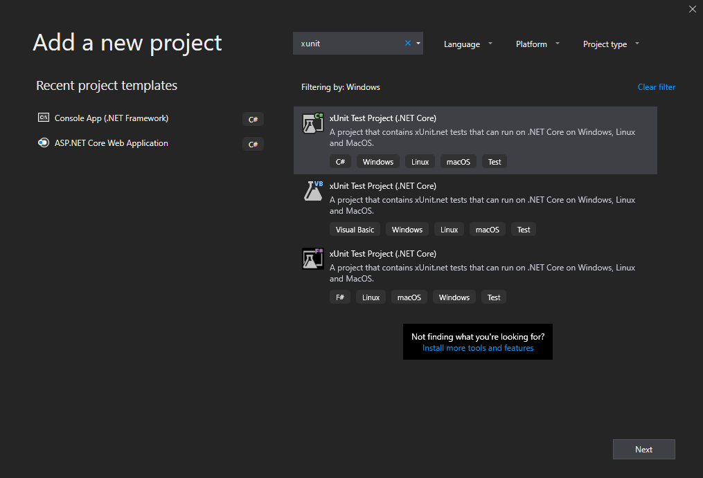
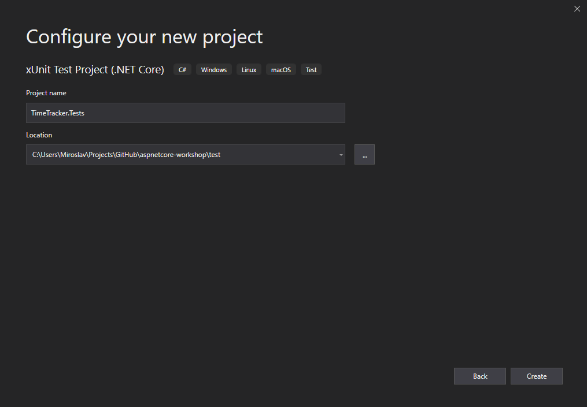
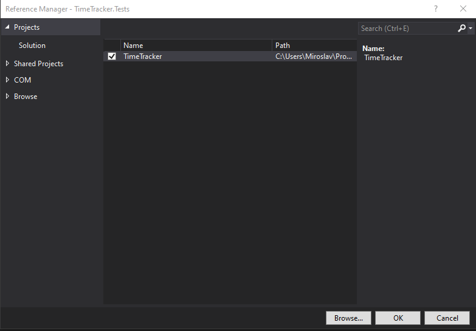
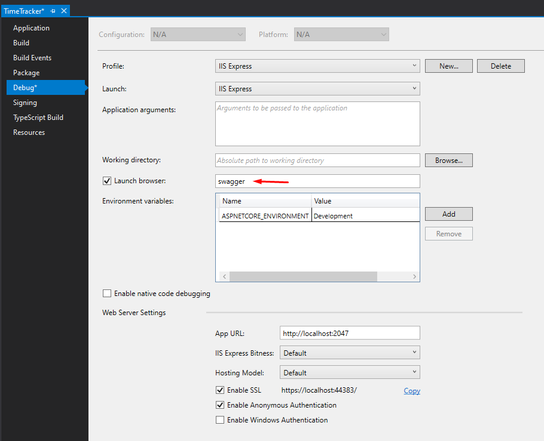
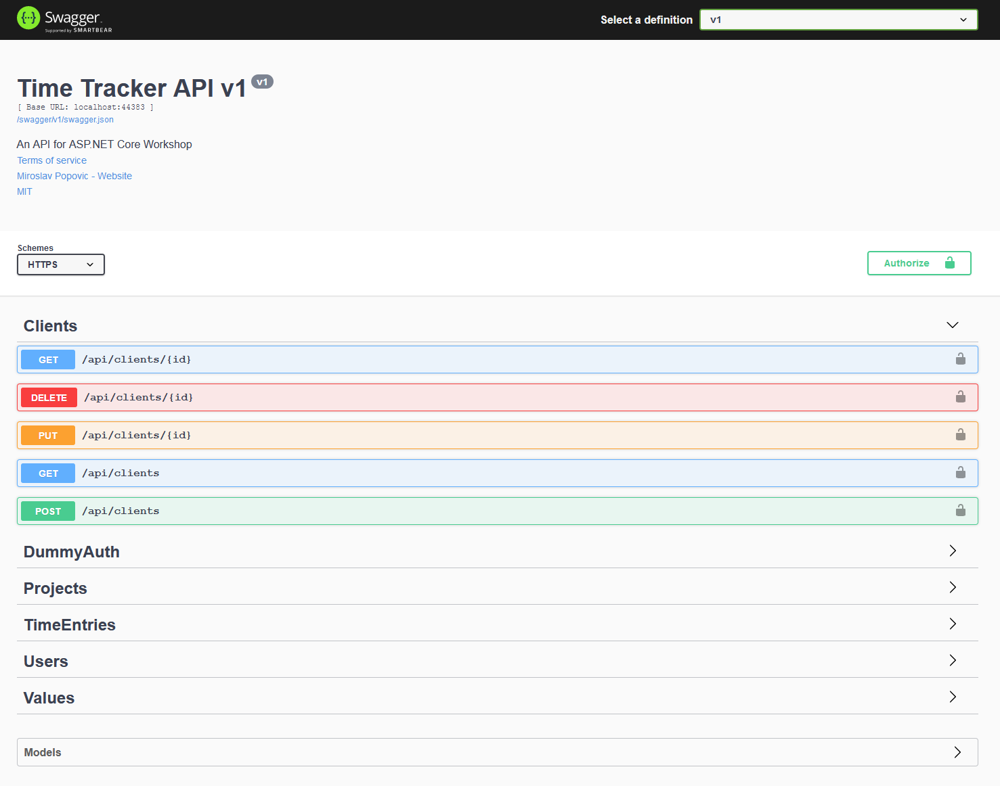
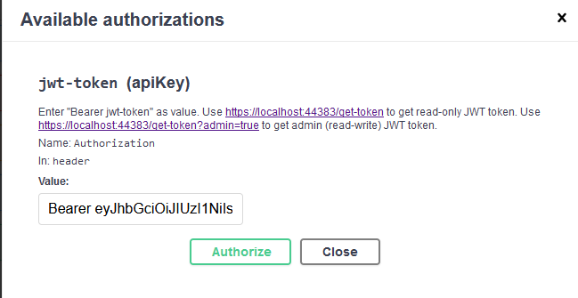
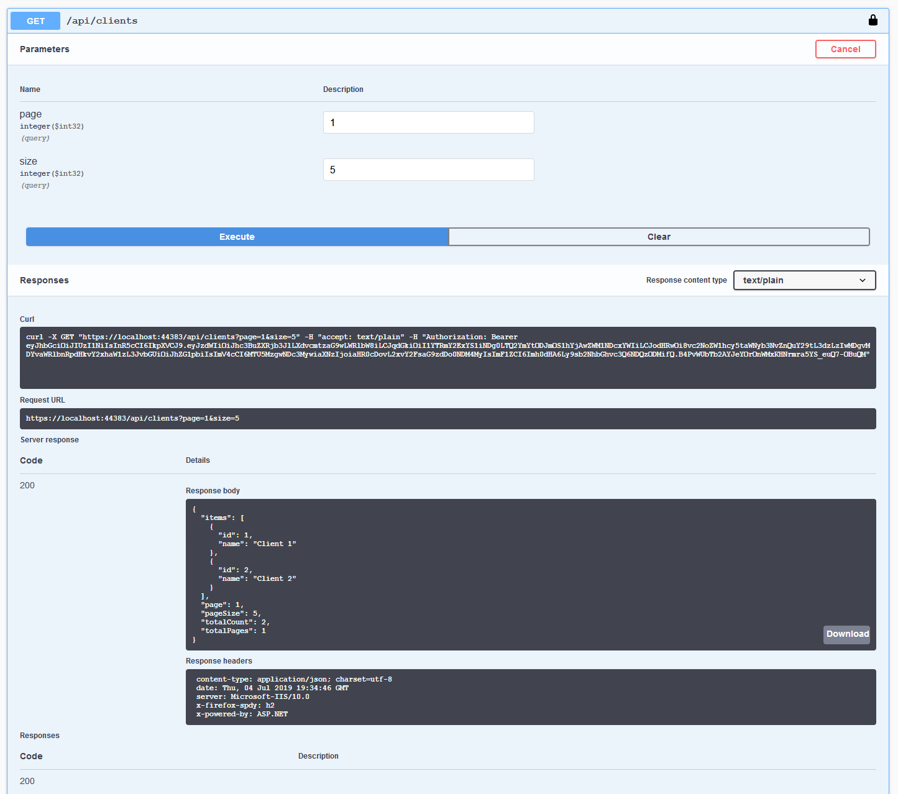
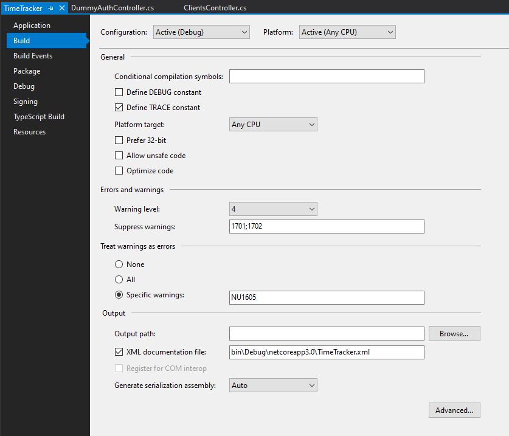

# Testing and documentation

In this part, we'll cover unit and integration testing of our controllers, as well as creating the API documentation using Swagger.

## Unit and integration testing

What is the difference between unit and integration testing?

With unit testing, you are testing a single unit of functionality of your application, usually a class, without the other parts affecting the test result. So the test is done in isolation. No other units nor their functionality will be triggered. In order to achieve that, if the class has dependencies, we are using test doubles (fakes, mocks or stubs - there's [a difference](https://blog.pragmatists.com/test-doubles-fakes-mocks-and-stubs-1a7491dfa3da) between these, but it's out of the scope of this workshop). This is where Dependency Injection really pays off. Usually, all the class dependencies are defined through constructor injection and are using interfaces. With that, it's easy to introduce test doubles. We'll unit test our controllers by giving them fake dependencies.

On the other hand, with integration tests, you are actually testing integration between multiple units or components or modules of your application. For integration testing, we'll create a test HTTP server, make HTTP calls and check the responses.

For writing our tests, we'll use [xUnit.net](https://xunit.net/) framework. It's the same test framework that .NET Core and ASP.NET Core teams are using for testing their code.

### Creating test project

Tests will be written in a separate project, as that's the best practice. Add a new test project by right clicking on the solution and choosing *Add > New Project*. Select *xUnit Test Project (.NET Core)* from the list and click *Next*.



Name the project `TimeTracker.Tests` and make sure it's saved under `test` folder (not under `src`). Click *Create*.



You'll get a new project with `UnitTest1.cs` file. Remove that file, as we'll add our tests in other files.

Now add the reference to `TimeTracker` project. Right click on the `TimeTracker.Tests` project in solution explorer, select *Add > Reference* and check `TimeTracker` project.



### Adding `UsersController` unit tests

Add a new folder in the project named `UnitTests`. Add a new class in it named `UsersControllerTests`. So, the plan is to create some unit tests for `UsersController`. The code for testing other controllers would be pretty similar, and we'll leave that as an exercise to the reader / attendee.

Depending on how your controllers are written, it can be easy, hard or nearly impossible to write unit tests. Controllers and action methods should not have a lot of logic. They should accept request, validate input models and handle it to some other service for processing. In our case, we only have EF Core `DbContext` as a service. When that service returns a response, action method should format the response accordingly and return to the caller.

Basically, controllers should behave as a kind of orchestrators. If they are defined like that it's very easy to unit test them. You call action method, giving it the input parameters and you check whether result is of correct HTTP status code and if it has expected body. That's it.

Enough theory, let's add our test class with the first test. xUnit tests need to be marked with the `[Fact]` attribute.

```c#
public class UsersControllerTests
{
    [Fact]
    public void GetById_IdIsNonExisting_ReturnsNotFoundResult()
    {
        var controller = new UsersController(??, ??);

        var result = controller.GetById(0);

        Assert.IsType<NotFoundResult>(result.Result);
    }
}
```

OK, we are missing the dependencies here. We said that we would use test doubles. `UsersController` has two dependencies, `TimeTrackerDbContext` is one and `ILogger<UsersController>` is another one. Creating test double for an interface is pretty straightforward so let's add that first.

```c#
public class FakeLogger<T> : ILogger<T>, IDisposable
{
    public IDisposable BeginScope<TState>(TState state)
    {
        return this; // This is why FakeLogger implements IDisposable
    }

    public bool IsEnabled(LogLevel logLevel)
    {
        return false;
    }

    public void Log<TState>(
        LogLevel logLevel, EventId eventId, TState state, Exception exception, Func<TState, Exception, string> formatter)
    {
        // Do nothing
    }

    public void Dispose()
    {
        // Do nothing
    }
}
```

This is a generic fake logger, so you can use it wherever you need `ILogger<T>`. It doesn't do anything except helping to fulfill the dependency and it won't affect test results. We won't go into details of the class above, since it should be self explanatory.

That was easy, but what about `TimeTrackerDbContext` dependency? It's a class and not an interface. We could inherit from it, and override all the methods, but that too wouldn't guarantee that some internal call would not be made. Also, not every method is virtual and can be overridden. We need something else.

Luckily, EF Core supports In Memory database that we can use for this purpose. We'll initialize our `TimeTrackerDbContext` with options for In Memory database.

One might argue that we would then be doing integration testing and not unit testing, and would be right. However, let's be pragmatic and consider this as valid unit testing scenario.

Each of our test would need to initialize `TimeTrackerDbContext`, `FakeLogger` and create a new instance of our SUT (system under test), our controller. Let's instead do that in setup method, which will be run before each test. Unlike other testing frameworks, xUnit doesn't have a separate notion of setup methods - it's just using the test class constructor. So, let's initialize our controller in constructor and use it in test.

In order to use In Memory, first add `Microsoft.EntityFrameworkCore.InMemory` NuGet package (prerelease version) to the `TimeTracker.Tests` project. While there, also update all other NuGet packages if there are newer versions.

Our test class now looks like this:

```c#
public class UsersControllerTests
{
    private readonly UsersController _controller;

    public UsersControllerTests()
    {
        var options = new DbContextOptionsBuilder<TimeTrackerDbContext>()
            .UseInMemoryDatabase(Guid.NewGuid().ToString())
            .Options;

        var dbContext = new TimeTrackerDbContext(options);
        var logger = new FakeLogger<UsersController>();

        // HACK: EF Core Preview 6 has issues, adding new values here
        dbContext.Users.Add(new User {Id = 1, Name = "Test User 1", HourRate = 15});
        dbContext.Users.Add(new User {Id = 2, Name = "Test User 2", HourRate = 20});
        dbContext.Users.Add(new User {Id = 3, Name = "Test User 3", HourRate = 25});
        dbContext.SaveChanges();

        _controller = new UsersController(dbContext, logger);
    }

    [Fact(Skip = "EF Core Preview issues - looking for entity with non-existing ID throws null reference exception")]
    public async Task GetById_IdIsNonExisting_ReturnsNotFoundResult()
    {
        var result = await _controller.GetById(0);

        Assert.IsType<NotFoundResult>(result);
    }
}
```

Note those pesky comments and extra lines above? It's because EF Core 3.0 Preview 6 has a lot of issues, which are clearly stated in [announcement post](https://devblogs.microsoft.com/dotnet/announcing-entity-framework-core-3-0-preview-6-and-entity-framework-6-3-preview-6/). This will be fixed with next release. For now, we have added *Skip* message to the `[Fact]`.

Run the test explorer in Visual Studio - *Test > Windows > Test Explorer* and select *Run All Tests*. Note that your test should be ignored, and not displayed as successful.


You can dock Test Explorer window somewhere. It will be updated as you add more tests and you'll be able to run or debug a single test or all tests.

Let's add a test for a success scenario:

```c#
[Fact]
public async Task GetById_IdExists_ReturnsCorrectResult()
{
    const string expectedName = "Test User 1";

    var result = await _controller.GetById(1);

    Assert.IsType<ActionResult<UserModel>>(result);
    Assert.NotNull(result.Value);
    Assert.Equal(expectedName, result.Value.Name);
}
```

Tests for getting a page of users would look like this:

```c#
[Fact]
public async Task GetPage_FirstPage_ReturnsExpectedResult()
{
    const int expectedCount = 3;
    const int expectedTotalCount = 3;

    var result = await _controller.GetPage(1, 10);

    Assert.IsType<ActionResult<PagedList<UserModel>>>(result);
    Assert.NotNull(result.Value);
    Assert.Equal(expectedCount, result.Value.Items.Count());
    Assert.Equal(expectedTotalCount, result.Value.TotalCount);
}

[Fact]
public async Task GetPage_SecondPage_ReturnsExpectedResult()
{
    const int expectedTotalCount = 3;

    var result = await _controller.GetPage(2, 10);

    Assert.IsType<ActionResult<PagedList<UserModel>>>(result);
    Assert.NotNull(result.Value);
    Assert.Empty(result.Value.Items);
    Assert.Equal(expectedTotalCount, result.Value.TotalCount);
}
```

And here are some tests for deleting users:

```c#
[Fact(Skip = "EF Core Preview issues - looking for entity with non-existing ID throws null reference exception")]
public async Task Delete_IdIsNotExisting_ReturnsNotFoundResult()
{
    var result = await _controller.Delete(0);

    Assert.IsType<NotFoundResult>(result);
}

[Fact]
public async Task Delete_IdExists_ReturnsOkResult()
{
    var result = await _controller.Delete(1);

    Assert.IsType<OkResult>(result);
}
```

Tests for other methods can be implemented the same. Same goes for testing other controllers.

### Adding Users API integration tests

Now let's add some integration tests that will test the HTTP surface of our APIs.

For this type of testing, we'll need to have a test server. ASP.NET Core is providing that in `Microsoft.AspNetCore.TestHost` NuGet package. Install it to the `TimeTracker.Tests` project (use prerelease).

We'll need to create a small change in our `Startup` class in order to configure Sqlite differently for testing purpose. First, add the following line at the top of `Startup` class:

```c#
public static Action<IConfiguration, DbContextOptionsBuilder> ConfigureDbContext = (configuration, options) =>
    options.UseSqlite(configuration.GetConnectionString("DefaultConnection"));
```

This will enable us to use a different configuration for DbContext from our tests. Then, modify the `AddDbContext` line in `Startup.ConfigureServices`, like this:

```c#
services.AddDbContext<TimeTrackerDbContext>(options => ConfigureDbContext(Configuration, options));
```

Add a new folder named `IntegrationTests` and in it `UsersApiTests` class. We'll also use constructor to initialize the things all our tests need - an `HttpClient` instance that will call our test server and two tokens, one for admin and one for non-admin access.

```c#
public class UsersApiTests
{
    private readonly HttpClient _client;
    private readonly SqliteConnection _connection;
    private readonly string _nonAdminToken;
    private readonly string _adminToken;

    public UsersApiTests()
    {
        const string issuer = "http://localhost:44383";
        const string key = "some-long-secret-key";

        // Must initialize and open Sqlite connection in order to keep in-memory database tables
        _connection = new SqliteConnection("DataSource=:memory:");
        _connection.Open();

        Startup.ConfigureDbContext = (configuration, builder) => builder.UseSqlite(_connection);

        var server = new TestServer(new WebHostBuilder()
            .UseSetting("Tokens:Issuer", issuer)
            .UseSetting("Tokens:Key", key)
            .UseStartup<Startup>()
            .UseUrls("https://localhost:44383"))
        {
            BaseAddress = new Uri("https://localhost:44383")
        };

        // Force creation of InMemory database
        var dbContext = server.Services.GetService<TimeTrackerDbContext>();
        dbContext.Database.EnsureCreated();

        _client = server.CreateClient();

        _nonAdminToken = JwtTokenGenerator.Generate(
            "aspnetcore-workshop-demo", false, issuer, key);
        _adminToken = JwtTokenGenerator.Generate(
            "aspnetcore-workshop-demo", true, issuer, key);
    }
}
```

Note that we are initializing some settings, including the override of the Sqlite settings to use SQLite In Memory implementation. This is different from EF Core In Memory database. Why do we need this? When doing testing, we need to make sure that the result of one test doesn't affect the other tests and that the order the tests are run doesn't matter.

For instance, if the test to delete item is run before the test to get the item with the same id, the latter test should not fail because the item is previously deleted. We need to reset the state of the database on each test. This will be achieved by using SQLite In Memory database and creating a new instance of it on each test run.

Great, now let's add few tests that will test the delete functionality.

```c#
[Fact]
public async Task Delete_NoAuthorizationHeader_ReturnsUnauthorized()
{
    _client.DefaultRequestHeaders.Clear();
    var result = await _client.DeleteAsync("/api/users/1");

    Assert.Equal(HttpStatusCode.Unauthorized, result.StatusCode);
}

[Fact]
public async Task Delete_NotAdmin_ReturnsForbidden()
{
    _client.DefaultRequestHeaders.Clear();
    _client.DefaultRequestHeaders
        .Add("Authorization", new[] { $"Bearer {_nonAdminToken}" });

    var result = await _client.DeleteAsync("/api/users/1");

    Assert.Equal(HttpStatusCode.Forbidden, result.StatusCode);
}

[Fact]
public async Task Delete_NoId_ReturnsMethodNotAllowed()
{
    _client.DefaultRequestHeaders.Clear();
    _client.DefaultRequestHeaders
        .Add("Authorization", new[] { $"Bearer {_adminToken}" });

    var result = await _client.DeleteAsync("/api/users/ ");

    Assert.Equal(HttpStatusCode.MethodNotAllowed, result.StatusCode);
}

[Fact]
public async Task Delete_NonExistingId_ReturnsNotFound()
{
    _client.DefaultRequestHeaders.Clear();
    _client.DefaultRequestHeaders
        .Add("Authorization", new[] { $"Bearer {_adminToken}" });

    var result = await _client.DeleteAsync("/api/users/0");

    Assert.Equal(HttpStatusCode.NotFound, result.StatusCode);
}

[Fact]
public async Task Delete_ExistingId_ReturnsOk()
{
    _client.DefaultRequestHeaders.Clear();
    _client.DefaultRequestHeaders
        .Add("Authorization", new[] { $"Bearer {_adminToken}" });

    var result = await _client.DeleteAsync("/api/users/1");

    Assert.Equal(HttpStatusCode.OK, result.StatusCode);
}
```

Here we go through testing some failure scenarios first - no Authorization header provided, non-admin token used, no id given. At the end, we are testing with success scenario.

As an exercise, create tests for other methods of Users API, as well as methods of Clients, Projects and Time Entry APIs.

## Documentation using Open API Specification / Swagger

Swagger, or Open API Specification 3.0, is an API framework. At its core,it just defines a standard JSON file for describing an API, but there's an entire ecosystem of tools and usage scenarios around it. Swagger can be used for API design, API development, API documentation, API testing, etc.

At this point, we are only interested in API documentation, so let's focus on providing a documentation for our API. We'll be using NSwag library, although there are others, like Swashbuckle.

Install `NSwag.AspNetCore` NuGet package to `TimeTracker` project. Also install `Microsoft.AspNetCore.Mvc.NewtonsoftJson` NuGet package (don't forget to include pre-release) as it is a requirement by NSwag.

Add a new services extension to `Extensions\ServiceCollectionExtensions`:

```c#
public static void AddOpenApi(this IServiceCollection services)
{
    services.AddSwaggerDocument(
        options =>
        {
            options.OperationProcessors.Add(
                new OperationSecurityScopeProcessor("jwt-token"));
            options.DocumentProcessors.Add(
                new SecurityDefinitionAppender(
                    "jwt-token", new[] { "" }, new OpenApiSecurityScheme
                    {
                        Type = OpenApiSecuritySchemeType.ApiKey,
                        Name = "Authorization",
                        Description =
                            "Enter \"Bearer jwt-token\" as value. " +
                            "Use https://localhost:44383/get-token to get read-only JWT token. " +
                            "Use https://localhost:44383/get-token?admin=true to get admin (read-write) JWT token.",
                        In = OpenApiSecurityApiKeyLocation.Header
                    }));

            options.PostProcess = document =>
            {
                document.Info.Version = "v1";
                document.Info.Title = "Time Tracker API v1";
                document.Info.Description = "An API for ASP.NET Core Workshop";
                document.Info.TermsOfService = "Do whatever you want with it :)";
                document.Info.Contact = new OpenApiContact
                {
                    Name = "Miroslav Popovic",
                    Email = string.Empty,
                    Url = "https://miroslavpopovic.com"
                };
                document.Info.License = new OpenApiLicense
                {
                    Name = "MIT",
                    Url = "https://opensource.org/licenses/MIT"
                };
            };
        });
}
```

Now use the extension method above in your `Startup`'s class `ConfigureServices` method: `services.AddOpenApi()`.

Also in `Startup` class, add the following two lines to `Configure` method after `app.UseAuthorization();`:

```c#
app.UseOpenApi();
app.UseSwaggerUi3();
```

Prior to this, whenever we start debugging our TimeTracker API, it would start the browser with `/api/values` URL. Let's change that to `swagger` and also remove `ValuesController` from the project. Right click on `TimeTracker` project in solution explorer and choose *Properties*. Go to *Debug* tab and modify *Launch browser* value:



When you debug your application now, it will go to `https://localhost:{port}/swagger` and you'll get your API documentation!



Spend some time browsing through the documentation. Notice how it describes actions, action types, request, responses...

It is also interactive! You are able to call API endpoints from within the Swagger interface. In order to do that, you need to have JWT token, as we are using token based authentication.

Click on the *Authorize* button on Swagger interface and enter the token generated by calling `https://localhost:{port}/get-token?admin=true`.



Once you have authorization ready, you can make calls from within Swagger UI. Expand `GET /api/clients` and click *Try it out*, modify some input parameters and then click *Execute*. The content below will change and contain the server response.



NSwag is greedy when reading controllers. By default, it loads all controllers. We need to skip `DummyAuthController` as it's not an API controller. To do that, we need to add `[OpenApiIgnore]` attribute to it:

```c#
[OpenApiIgnore]
public class DummyAuthController : Controller
{
    // ...
}
```

We can improve our documentation by adding XML documentation comments and some metadata via attributes. We need to have XML comments for controllers, action methods and all models. For example, here's how our models and controller methods should look like:

```c#
/// <summary>
/// Represents a single user to add or modify.
/// </summary>
public class UserInputModel
{
    /// <summary>
    /// Gets or sets the user name.
    /// </summary>
    public string Name { get; set; }

    /// <summary>
    /// Gets or sets the user hour rate.
    /// </summary>
    public decimal HourRate { get; set; }

    /// <summary>
    /// Maps the current model to the instance of <see cref="User"/>.
    /// </summary>
    /// <param name="user">A <see cref="User"/> instance to modify.</param>
    public void MapTo(User user)
    {
        user.Name = Name;
        user.HourRate = HourRate;
    }
}
```

```c#
// In UsersController
/// <summary>
/// Modify the user with the given id, using the supplied data.
/// </summary>
/// <param name="id">Id of the user to modify.</param>
/// <param name="model">Data to modify the user from.</param>
[Authorize(Roles = "admin")]
[HttpPut("{id}")]
[ProducesResponseType(StatusCodes.Status200OK, Type = typeof(UserModel))]
[ProducesResponseType(StatusCodes.Status404NotFound)]
public async Task<ActionResult<UserModel>> Update(long id, UserInputModel model)
{
    // ...
}

```

Note that your Swagger UI won't show XML documentation until you enable the generation of XML documentation file in project properties.



If you run the Swagger UI interface now, you'll notice a lot more information started to appear.

You can check the source code of this repository for result of adding XML comments and attributes.

-------

Next: [Versioning, usage limiting and monitoring](09-versioning-limiting-monitoring.md)
